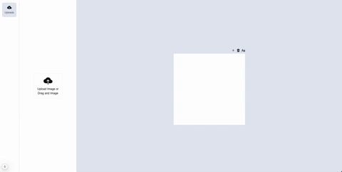

# Slide Editor v0

## Demo

See below a demonstration of the application in action:




## About the Project

This project is an application based on the famous Canva, but with custom functionalities to facilitate slide creation and editing. With it, you can:

- Upload multiple images.
- Add images to the slide editor.
- Resize and rotate images.
- Add texts.
- Create multiple pages.

### Main Features

- **Image Upload:** To add images to the project, just drag them over any area of the app or click the upload button
- **Drag and Drop:** To add images to a slide, just drag them to the editor.
- **Text Creation:** Click the icon above the page to add texts.
- **Intuitive Interface:** The layout is simple and easy to use, ensuring a great experience for visual content creation.

## Installation Requirements

### System Dependencies

Before starting, make sure your system has the necessary libraries to run the project.

#### macOS

On macOS, run the following command in the terminal to install dependencies:

```bash
brew install pkg-config cairo pango libpng jpeg giflib librsvg
```

#### Linux

On Linux, use your distribution's package manager. For Debian/Ubuntu-based distributions, for example:

```bash
sudo apt-get install pkg-config libcairo2-dev libpango1.0-dev libpng-dev libjpeg-dev libgif-dev librsvg2-dev
```

#### Windows

On Windows, you can install the libraries via MSYS2:

1. Install [MSYS2](https://www.msys2.org/).
2. Open the MSYS2 terminal and run:

```bash
pacman -S mingw-w64-x86_64-pkg-config mingw-w64-x86_64-cairo mingw-w64-x86_64-pango mingw-w64-x86_64-libpng mingw-w64-x86_64-librsvg
```

### Project Setup

After installing the system dependencies, follow the steps below to set up the project:

1. Clone the repository:

   ```bash
   git clone <REPOSITORY_URL>
   cd <PROJECT_FOLDER>
   ```

2. Install project dependencies:

   ```bash
   npm install
   ```

3. Start the development server:

   ```bash
   npm run dev
   ```

4. Open your browser at [http://localhost:3000](http://localhost:3000) to access the app.

## How to Use

1. **Adding Images:**

   - Upload images to the library.
   - Drag the desired images to the slide editor.

2. **Editing Images:**

   - Resize or rotate images directly in the editor.

3. **Adding Texts:**

   - Click the text icon located above the page to add new texts.

4. **Creating Multiple Pages:**
   - Navigate between pages and use the available tools to create additional slides.

# Future Possible Improvements

We are continuously working to improve the application. Some improvements and new features that are planned for future versions include:

- **Click on Image to Edit**: Allow users to click directly on images to access editing options, facilitating navigation and editing in the slide.

- **Image Crop Implementation**: Add a crop tool so users can adjust and crop images before using them in slides.

- **Infinite List with Virtualization**: Implement an infinite list with virtualization to ensure optimized performance when working with large amounts of images or slides.

- **Page Transitions and Animations**: Add transitions and animations when creating or switching between pages to improve visual experience and interactivity.

- **Image and Text Deletion**: Allow users to delete images or texts directly from the slide, offering more flexibility and control during the creation process.

## License

This project is licensed under the [MIT License](LICENSE).
